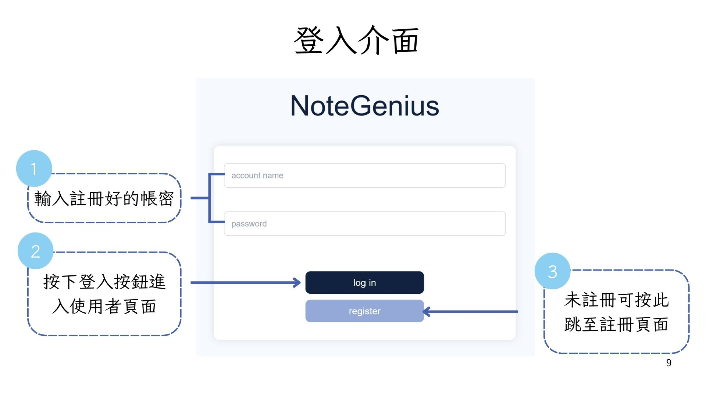
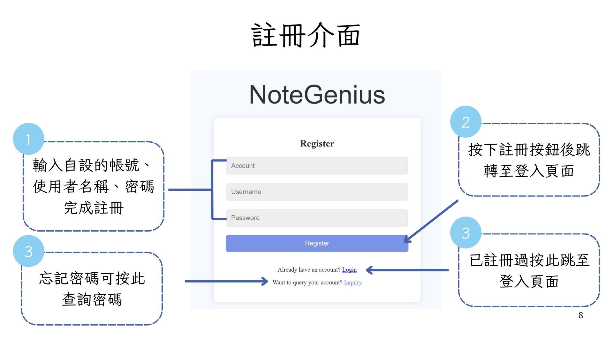
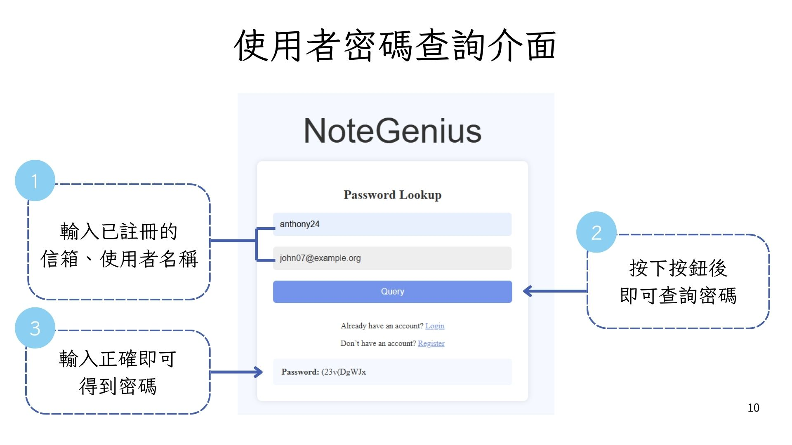
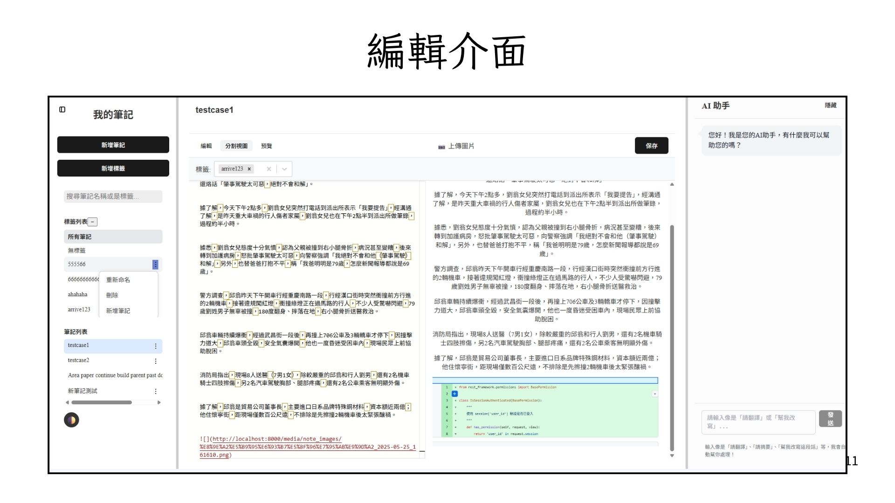
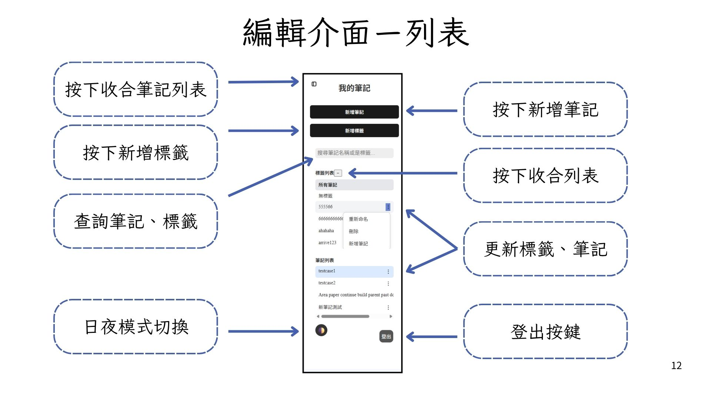
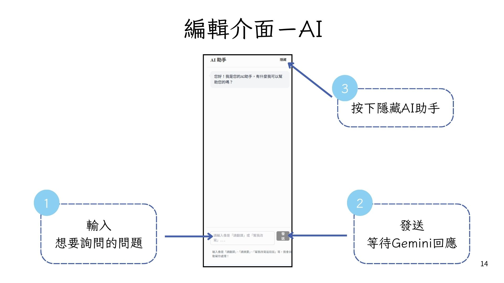

# NoteGenius

A modern note-taking platform that combines an AI assistant with note management to help users efficiently organize, classify, query, and rewrite their notes.

**Project Highlights**  
🧠 **AI Smart Note Assist**: Integrates with Google Gemini API to provide one-click translation, summarization, and rewriting, making notes not just records but tools for understanding and reinforcement.  
🗂 **Classification & Tagging System**: Supports multiple notes and multiple tags for easy organization and quick searching.  
🔐 **Account System & Personal Note Space**: Each user has an exclusive note area with registration, login, and password recovery features.  
🌓 **UI/UX Enhancements**: Interactive features include day/night mode, Markdown editing, and image uploading.

---

## System Architecture

```
Frontend: React  
Backend: Django (REST Framework)  
Database: MySQL  
AI Model: Google Gemini API
```

---

## Features

### 使用者功能

* 註冊、登入、忘記密碼
* 個人化筆記空間
* 筆記 CRUD（建立、查看、編輯、刪除）
* 筆記標籤管理
* 圖片上傳、MarkDown 編輯
* 日夜主題切換

### AI（Gemini API）
- **One-Click**:
- Summarization
- Translation
- Rewriting
- Q&A Conversations

---

## 📷 Demo Preview

<p align="center">
  
</p>
<p align="center">
  
</p>
<p align="center">
  
</p>
<p align="center">
  
</p>
<p align="center">
  
</p>
<p align="center">
  
</p>
<p align="center">
  
</p>

## Feature Roadmap

* Permission system and admin backend  
* Note versioning and history tracking  
* Collaborative editing and real-time sync  
* Smarter AI responses and personalized models  

| Week | Tasks                                |
| ---- | ------------------------------------ |
| 1    | Set up project structure and plan APIs |
| 2    | Basic CRUD and UI prototypes         |
| 3    | Frontend-backend integration & AI features |
| 4    | UI optimizations, bug fixes, and presentation prep |

---

## 🙌 Contributors

[Forked From](https://github.com/liu-chun-wu/NoteGenius)  
<p align="center">
  
</p>
